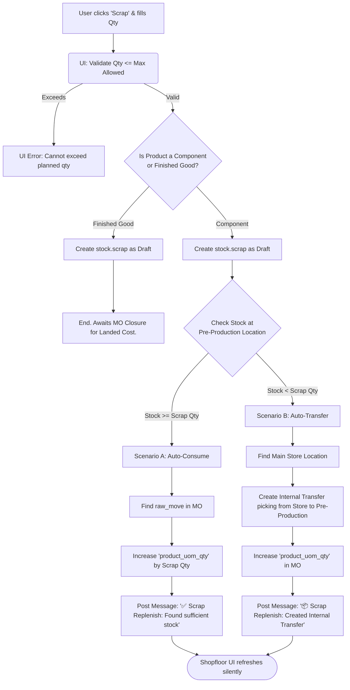
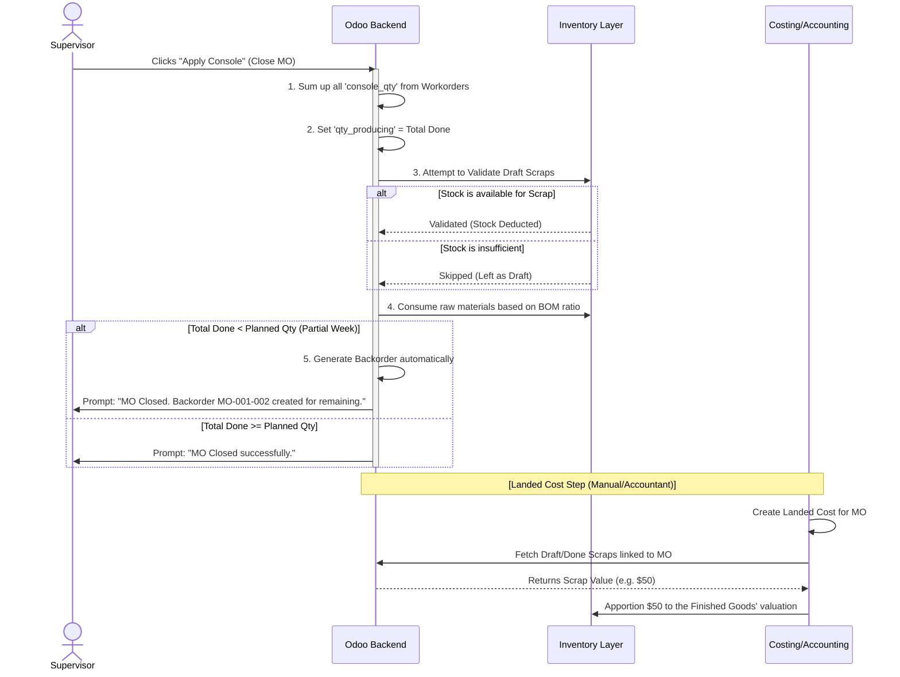

# Workflow Diagram: Odoo 18 MRP Parallel Console & Scrap Flow

This document visualizes the entire lifecycle of a Shopfloor Workorder, from starting the job, doing partial completions, recording scraps, and finally closing the Manufacturing Order (MO).

You can copy and paste the Mermaid code below into [Mermaid Live Editor](https://mermaid.live/) to generate a beautiful diagram, or view it natively in GitHub/VSCode.

## 1. Overall Shopfloor Workorder Flow (Start to Finish)

```mermaid
stateDiagram-v2
    %% Entities
    actor User as Shopfloor Operator
    participant UI as Console UI (JS)
    participant Ctrl as Controller (Python)
    participant DB as Odoo Database

    %% Flow
    User ->> UI: 1. Click "Start" on Workorder
    UI ->> Ctrl: check_components()
    Ctrl -->> UI: OK (Components Available)
    UI ->> Ctrl: start_workorder()
    Ctrl ->> DB: Start Timer & Change state to 'progress'

    Note right of User: Operator is working...

    User ->> UI: 2. Click "Quick Done" (Partial / Full completion)
    UI ->> Ctrl: quick_done(qty)
    Ctrl ->> DB: Log qty to 'console_qty'
    Ctrl ->> DB: Stop Timer (if finished)
    Ctrl ->> DB: Update state to 'done' (if fully done)
    Ctrl -->> UI: Success

    User ->> UI: 3. Click "Close Production" (Top Menu)
    UI ->> Ctrl: apply_console(workorder_ids)
    Ctrl ->> DB: Sync Component Demands
    Ctrl ->> DB: Validate Lots (if tracked)
    Ctrl ->> DB: Auto-Validate Scraps (draft -> done)
    Ctrl ->> DB: Create Backorder (if qty_produced < product_qty)
    Ctrl ->> DB: Close MO (button_mark_done)
    Ctrl -->> UI: MO Closed Successfully
```

<br>

## 2. The New Auto-Replenish Scrap Workflow

This diagram explains exactly what happens under the hood when a user records a damaged component (Scrap). It highlights the custom logic we just implemented.



<br>

## 3. End of Shift / MO Closure Workflow (Backorder & Scrap Handling)

Since your factory produces "day by day" but opens MOs "weekly", this is how Odoo handles the discrepancies when closing the MO.


