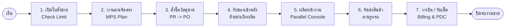

# 📌 00. ภาพรวมการไหลเวียนแบบเส้นตรง (Linear Flow)

นี่คือขั้นตอนการทำงานตั้งแต่ "ต้นน้ำ (ขาย)" ไปจนถึง "ปลายน้ำ (บัญชีเงินเข้า)" แบบเข้าใจง่ายที่สุด

---

## 🟢 ขั้นตอนการทำงานจริง (Happy Path)

| ลำดับ | กิจกรรมที่เกิดขึ้น | Module / หน้าจอที่ใช้ | ผู้รับผิดชอบหลัก |
| :--- | :--- | :--- | :--- |
| **1** | **รับคำสั่งซื้อ**   🔹 ดึงรายการสั่งซื้อเข้าสู่ระบบ   🔹 ตรวจเช็คยอดค้างพาร์ตเนอร์ | 📑 **Sales (SO)**   🧩 `sale_order_import_goldmints`   🧩 `partner_credit_limit_sale_block` | ฝ่ายขาย (Sales) |
| **2** | **กดปุ่มรันจัดสรร**   🔹 วางแผนจำนวนผลิตและยอดที่ต้องซื้อ | 📅 **MPS Planning**   🧩 `mrp_mps_mo_tracking` | ฝ่ายวางแผน (Planner) |
| **3** | **จัดซื้อวัตถุดิบ**   🔹 ส่งขออนุมัติจัดซื้อถ้าของขาด   🔹 แปลงเป็นใบสั่งซื้อ PO | 🛒 **Purchase (PR/PO)**   🧩 `oi_workflow_purchase_request` | ฝ่ายจัดซื้อ (Procurement) |
| **4** | **รับของเข้าคลัง**   🔹 คีย์รับของเข้า Main Location   🔹 ย้ายของป้อนจุดผลิต | 📦 **Inventory (Receipt)**   🧩 `nano_transfer_product_lot` | ฝ่ายคลังสินค้า (Stock) |
| **5** | **ผลิตต่อเนื่อง**   🔹 กด Start/Done ทยอยจบยอดยอด   🔹 สลัดเคลมวัสดุที่เสีย Auto | ⚙️ **Manufacturing (MO)**   🧩 `mrp_parallel_console`   🧩 `mrp_scrap_auto_replenish` | พนักงานระดับหน้างาน (Operator) |
| **6** | **จัดส่งลูกค้า**   🔹 ขับรถส่งตามเส้นทางและบีบยอดออก | 🚚 **Inventory (Delivery)**   🧩 `delivery_routes_management` | ฝ่ายจัดส่ง (Logistics) |
| **7** | **เปิดบิลและรับเงิน**   🔹 รวมบิลจัดส่งทำดิวเดียว   🔹 เก็บเช็ค Clearing ยอดบวกลบ | 🧾 **Accounting (Invoice/PDC)**   🧩 `account_billing_create`   🧩 `sh_pdc` | ฝ่ายบัญชี (Accounting) |

---

## 📊 แผนภาพเส้นตรง (Linear Diagram)

---

## 📊 แผนภาพมุมมองบนลงล่าง (Top-Down Flow)

---
💡 *ไฟล์ถัดๆ ไปในโฟลเดอร์นี้จะอธิบาย "แต่ละ Module อย่างละเอียด" ครับ*
