# Purchase Asset Flow Diagram (Swimlane)

อ้างอิงจากการตรวจ flow และ custom ในฐาน `view`

โมดูลหลักที่เกี่ยวข้อง:
- `purchase`
- `stock`
- `account`
- `account_asset_management`
- `auto_asset_from_vendor_bill`
- `account_asset_customization`
- `account_asset_number`
- `account_asset_history`

เงื่อนไข setup ที่ต้องมี:
- `Product Category` ของสินค้าถูกติ๊ก `Treat as Asset`
- `Product` มีค่า `Asset Model`
- ผู้ใช้มีสิทธิ์ทำ `Purchase`, `Vendor Bill`, และ `Asset`

```mermaid
flowchart LR
  subgraph U["ผู้ใช้งาน / จัดซื้อ"]
    U1["กำหนดความต้องการซื้อ Asset"] --> U2["สร้าง RFQ / PO"]
    U2 --> U3["ยืนยัน PO"]
  end

  subgraph P["Purchase"]
    P1["สร้างใบสั่งซื้อจาก Vendor และสินค้า"] --> P2["PO อยู่สถานะ Purchase Order"]
    P2 --> P3{"ต้องรับสินค้าก่อนวางบิลหรือไม่"}
    P3 -->|"ใช่"| P4["ส่งงานไป Inventory เพื่อรับเข้า"]
    P3 -->|"ไม่ใช่"| P5["สร้าง Vendor Bill ได้ทันที"]
  end

  subgraph I["Inventory"]
    I1["สร้าง Receipt จาก PO"] --> I2["ตรวจรับสินค้า / ใส่จำนวนรับจริง"]
    I2 --> I3["Validate Receipt"]
    I3 --> I4["สต็อกเพิ่ม และ PO อัปเดต Received Qty"]
  end

  subgraph A["Accounting"]
    A1["สร้าง Vendor Bill จาก PO / Receipt"] --> A2["ตรวจภาษี ราคา บัญชีค่าใช้จ่าย"]
    A2 --> A3["Post Vendor Bill"]
    A3 --> A4{"บิลมีสินค้าที่ Category = Treat as Asset หรือไม่"}
    A4 -->|"มี"| A5["ระบบแสดงปุ่ม Create Assets บน Vendor Bill"]
    A4 -->|"ไม่มี"| A9["จบเป็น AP ปกติ ไม่สร้าง Asset"]
    A5 --> A6["ผู้ใช้กด Create Assets"]
    A6 --> A7["Wizard ดึง bill lines ที่เป็น Asset ขึ้นมา"]
    A7 --> A8["เลือก Asset Model / Split Individual / Existing Asset / Parent Asset"]
  end

  subgraph M["Asset Management"]
    M1["ระบบสร้าง Asset Draft และลิงก์กลับไปที่ Vendor Bill"] --> M2["ตรวจชื่อทรัพย์สิน เลขทรัพย์สิน มูลค่า วันที่ได้มา"]
    M2 --> M3["กรอก Responsible / Asset Location / บัญชีที่เกี่ยวข้อง"]
    M3 --> M4["Validate Asset"]
    M4 --> M5["Compute Depreciation Board"]
    M5 --> M6["ระบบเตรียมงวดค่าเสื่อม"]
    M6 --> M7["Post Depreciation Journal ตามงวด"]
    M7 --> M8["Asset อยู่ในสถานะใช้งาน และติดตามต่อจนปิด / จำหน่าย"]
  end

  U1 --> P1
  U3 --> P2
  P4 --> I1
  P5 --> A1
  I4 --> A1
  A8 --> M1
```

## คำอธิบายทีละ Lane

### 1. ผู้ใช้งาน / จัดซื้อ
- เริ่มจากความต้องการซื้อทรัพย์สิน เช่น คอมพิวเตอร์, เครื่องจักร, อุปกรณ์สำนักงาน
- สร้าง `RFQ / PO`
- ยืนยัน PO เพื่อให้ระบบเปิด flow ถัดไป

### 2. Purchase
- PO เก็บข้อมูลผู้ขาย, สินค้า, จำนวน, ราคา, ภาษี, เงื่อนไขรับสินค้า
- หลังยืนยัน PO ระบบจะตัดสินใจตามประเภท flow:
  - ถ้าต้องรับของก่อนวางบิล: ไป lane `Inventory`
  - ถ้าเป็นกรณีไม่รับของก่อน: ไปสร้าง `Vendor Bill` ได้ทันที

### 3. Inventory
- เมื่อ PO ต้องรับของ ระบบสร้าง `Receipt`
- ผู้ใช้ตรวจรับและ `Validate Receipt`
- ผลคือ quantity received ใน PO ถูกอัปเดต และถ้าสินค้ามี stock control ก็เกิด movement ตามปกติ

### 4. Accounting
- สร้าง `Vendor Bill` จาก PO หรือ Receipt
- ตรวจความถูกต้องของราคา, ภาษี, บัญชี
- เมื่อ `Post Vendor Bill` แล้ว custom `auto_asset_from_vendor_bill` จะตรวจว่า bill line ใดอยู่ใน category ที่ติ๊ก `Treat as Asset`
- ถ้ามี ระบบจะแสดงปุ่ม `Create Assets`
- เมื่อกดปุ่ม จะเปิด wizard ให้เลือกวิธีสร้าง asset:
  - `Asset Model`
  - `Split Individual`
  - `Target Asset`
  - `Parent Asset`

### 5. Asset Management
- ระบบสร้าง `account.asset` สถานะ draft และผูกกลับไปที่ `Vendor Bill`
- ผู้ใช้ตรวจข้อมูล asset:
  - ชื่อ asset
  - เลข asset
  - มูลค่าตั้งต้น
  - วันที่ได้มา
  - ผู้รับผิดชอบ
  - สถานที่ใช้งาน
  - บัญชีสินทรัพย์ / ค่าเสื่อมสะสม / ค่าเสื่อมราคา
- จากนั้น `Validate Asset`
- ระบบคำนวณ `Depreciation Board`
- เมื่อถึงรอบบัญชี ผู้ใช้หรือระบบจะ `Post Depreciation Journal`
- หลังจากนั้น asset จะอยู่ในสถานะใช้งานจนกว่าจะมีการโอน, ปรับปรุง, จำหน่าย หรือปิด

## จุดสำคัญของ custom ในระบบนี้

### `auto_asset_from_vendor_bill`
- เพิ่ม field `Treat as Asset` ที่ `Product Category`
- เพิ่ม field `Asset Model` ที่ `Product`
- เมื่อ post bill แล้ว ถ้ามี line ที่เป็น asset ระบบจะแสดงปุ่ม `Create Assets`
- wizard รองรับ:
  - สร้าง asset เดียว
  - แตกหลาย asset ตามจำนวน (`Split Individual`)
  - บวกเข้าทรัพย์สินเดิม (`Target Asset`)
  - ผูกเป็น asset ย่อย (`Parent Asset`)

### `account_asset_customization`
- เพิ่ม `Responsible`
- เพิ่ม `Asset Location`

### `account_asset_number`
- เพิ่มเลขทรัพย์สิน (`number`) บนฟอร์ม asset

### `account_asset_history`
- รองรับการเก็บประวัติการแก้ไข / pause / resume / dispose / sell

## ตัวอย่างที่พบจริงในฐาน `view`

ตัวอย่างบิลที่ใช้ custom นี้แล้ว:
- `APD/26/03/00004`
- `APD/26/03/00010`
- `APD/26/03/00012`

ตัวอย่างผลลัพธ์ที่พบ:
- `Laptop for Verification (1/2)`
- `Laptop for Verification (2/2)`

กรณีนี้สะท้อนว่า wizard ถูกใช้ในแบบ `Split Individual`

## ข้อควรระวัง

- ถ้า `Product Category` ไม่ติ๊ก `Treat as Asset` จะไม่ขึ้นปุ่ม `Create Assets`
- ถ้า `Product` ไม่มี `Asset Model` ผู้ใช้ต้องเลือก model ใน wizard ให้ครบ ไม่เช่นนั้น asset ที่ได้อาจไม่สมบูรณ์
- บาง bill เก่าในฐาน `view` มี asset ที่ถูกสร้างแล้วแต่มูลค่าไม่สมบูรณ์ จึงควรใช้ flow ใหม่เป็นหลักในการทดสอบและทำคู่มือ

