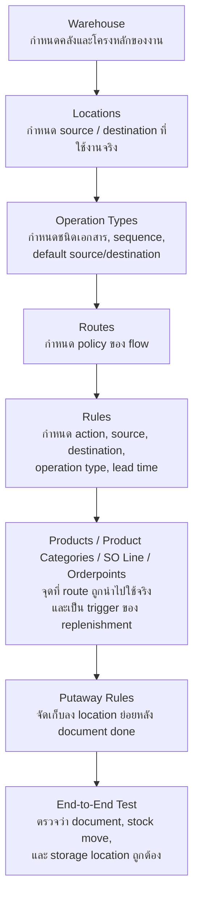

# Setup Dependency Diagram: Warehouse -> Location -> Operation Type -> Route -> Rule -> Product/Orderpoint -> Putaway

## วัตถุประสงค์
ใช้เอกสารนี้อธิบายว่าถ้าจะตั้งค่า flow ใน Odoo ให้ถูก ต้องสร้างอะไรก่อน อะไรหลัง และแต่ละ table เชื่อมกันอย่างไร

## ลำดับการตั้งค่าที่แนะนำ
1. `Warehouse`
2. `Locations`
3. `Operation Types`
4. `Routes`
5. `Rules`
6. `Products / Product Categories / Orderpoints`
7. `Putaway Rules`
8. `End-to-End Test`

## ภาพรวมแบบย่อ
- `Warehouse` คือกรอบใหญ่ของการไหล เช่น GMP, M-WH
- `Location` คือจุดเก็บของจริง เช่น GMP/Stock, GMP/Output, GMP/Stock/คลังลอย
- `Operation Type` คือแม่แบบเอกสาร เช่น Receipts, Transfer Plastic, Manufacturing Pharma
- `Route` คือ policy ว่าจะไปซื้อ ผลิต หรือโอน
- `Rule` คือคำสั่งจริงที่ระบบใช้ทำงาน โดยจะอ้าง Route และ Operation Type
- `Product / Orderpoint` คือจุดที่เอา Route ไปใช้จริง และเป็น trigger ของ replenishment
- `Putaway` คือกฎปลายทางหลังของถึง location ใหญ่แล้วว่าจะจัดลง location ย่อยไหน

## Mermaid Diagram

## ความเชื่อมโยงทีละชั้น

### 1. Warehouse
- ใช้กำหนดกรอบการทำงานของคลัง
- เป็นตัว parent ของ location หลายตัว
- บาง route และ operation type จะผูกระดับ warehouse

### 2. Location
- ใช้กำหนดแหล่งต้นทางและปลายทางของ stock move
- Operation Type ต้องรู้ location default
- Rule ต้องรู้ source และ destination
- Putaway ต้องรู้ destination location ใหญ่ก่อน

### 3. Operation Type
- เป็น table ที่กำหนดแม่แบบเอกสาร
- Rule จะอ้าง operation type เพื่อบอกว่าต้องสร้าง document ชนิดไหน
- ถ้ายังไม่มี operation type, rule จะอ้าง document ปลายทางไม่ได้

### 4. Route
- เป็นกล่อง policy
- Route หนึ่งตัวมี rule ได้หลายตัว
- ตัว product, product category, warehouse หรือ SO line จะเลือก route ไปใช้งาน

### 5. Rule
- เป็นตัวทำงานจริง
- ระบุ action เช่น `buy`, `manufacture`, `pull`
- ระบุ `Source Location`, `Destination Location`
- ระบุ `Operation Type`
- ระบุ `Route` ที่ตัวเองสังกัด

### 6. Product / Orderpoint
- เป็นชั้นที่ route ถูกนำไปใช้จริง
- product route บอกว่าสินค้าตัวนี้ควรเดินทางแบบไหน
- orderpoint เป็น trigger ของ replenishment
- เมื่อ replenishment เกิด ระบบจึงค่อยไปหา route และ rule ที่เกี่ยวข้อง

### 7. Putaway
- ไม่ได้เป็น procurement trigger
- ไม่ได้สั่งซื้อหรือสั่งผลิต
- ทำหน้าที่รับของจาก destination location ใหญ่ แล้วจัดเก็บลงตำแหน่งย่อย

## ถ้าจะจำแบบสั้นมาก
- `Warehouse / Location` = โครงสร้างที่ของวิ่งอยู่
- `Operation Type` = เอกสารที่ user เห็น
- `Route` = นโยบาย
- `Rule` = วิธีทำจริง
- `Product / Orderpoint` = จุดเริ่มใช้งานจริง
- `Putaway` = การจัดเก็บปลายทาง

## ตัวอย่างจาก UAT
- `Manufacture (Pharma)` เป็น Route
- `Rule 146` อยู่ใน route นี้
- `Rule 146` ใช้ `Operation Type = Manufacturing Pharma`
- Product อย่าง `FG-PNC-TH-01001` ใช้ route นี้จริง
- ถ้าถึง `GMP/Stock` แล้ว และ category เข้าเงื่อนไข putaway ระบบจะย้ายไป location ย่อยต่อ
